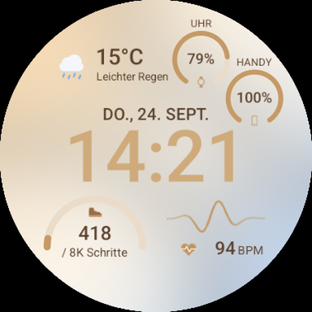

# Pixel Sand – Wear OS Watch Face

Ein Zifferblatt für Wear OS im [Watch Face Format](https://developer.android.com/training/wearables/wff) (WFF v2) mit warmem Farbverlauf, großer Digitaluhr, Wetter, Fitness-Daten und Handy-Akku.



## Features

- Digitaluhr (12h/24h je nach Systemeinstellung, AM/PM im 12h-Modus), eigene Ambient-Darstellung
- Wetter: Temperatur (°C/°F), Zustandsname und Icon (Sonne, Mond, Wolken, Regen, Schnee, Gewitter, Nebel, Wind – Tag/Nacht)
- Herzfrequenz, Uhr-Akkustand
- Schritte mit Fortschritt zum Tagesziel (`STEP_GOAL`)
- Complication-Slot **Handy-Akku** (`RANGED_VALUE` als Fortschrittsbalken, alternativ `SHORT_TEXT`)

## Projektstruktur

```
watchface/src/main/res/raw/watchface.xml   # WFF-Layout
watchface/src/main/res/drawable-nodpi/     # Hintergrund & Icons (generiert)
watchface/src/main/res/drawable/preview.png
tools/generate_assets.py                   # erzeugt die Bitmaps (Pillow)
tools/generate_store_assets.py             # erzeugt die Play-Store-Grafiken
playstore/                                 # Store-Grafiken und -Texte
```

## Bauen & Installieren

Voraussetzungen: Android Studio / Android SDK (compileSdk 37, minSdk 34), JDK.

```sh
./gradlew :watchface:assembleDebug
adb install -r watchface/build/outputs/apk/debug/watchface-debug.apk
```

Danach auf der Uhr das Zifferblatt **Pixel Sand** auswählen.

> Hinweis: Die Uhr speichert die gewählten Datenquellen pro Slot-Position. Nach Änderungen an
> Anzahl/Reihenfolge der Slots die App vorher deinstallieren (`adb uninstall de.martinsmikrokosmos.pixelsand`).

## Release für Google Play

1. `keystore.properties.example` nach `keystore.properties` kopieren und den Upload-Key eintragen
   (Datei und Keystore werden nicht eingecheckt).
2. `versionCode` in `watchface/build.gradle.kts` erhöhen.
3. Signiertes App-Bundle bauen:

```sh
./gradlew :watchface:bundleRelease
# -> watchface/build/outputs/bundle/release/watchface-release.aab
```

Store-Texte, Grafiken und Angaben zur Datensicherheit: [`playstore/listing.md`](playstore/listing.md),
Datenschutzerklärung: [`PRIVACY.md`](PRIVACY.md).

## Assets neu generieren

```sh
pip install pillow
python3 tools/generate_assets.py
```
